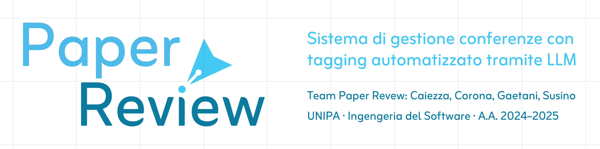

# ✒️ PAPER REVIEW

## 📖 Introduzione

Questa è la repo di **Paper Review**, progetto di **Ingegneria del Software** dell'A.A **2024-2025**.

Paper Review è un **CMS** (Conference Management System) con funzionalità estese per permettere una **gestione omnicomprensiva** del ciclo di vita dei **paper scientifici**!

Oltre all'**implementazione JavaFX** dell'applicazione vera e propria, prevede anche un' implementazione di un' **API LLAMA** per fare in modo di **generare automaticamente i tag dei paper**.

## 📂 Struttura della repository

La repo è organizzata per facilitare la navigazione tra le varie sezioni. Ecco la **struttura principale**:

```
┌── Codice/                	# ⚙️ I codici delle parti applicative del progetto
│   ├── Api LLM/		# 🦙 L'implementazione API dell'LLM LLAMA
│   ├── Paper Review/		# ☕ L'implementazione JavaFX dell'applicazione
│   └── Paper Review Server/	# 🐧 L'implementazione server dell'applicazione
├── Documenti/         		# 📄 I documenti che sono stati prodotti
│   ├── RAD.pdf
│   ├── SDD.pdf
│   └── ODD.pdf
├── Grafici/              	# 📊 I grafici che sono stati utilizzati all'interno dei documenti
│   ├── Diagrammi Paper Review.asta
│   └── ...
├── Risorse/               	# 📦 Risorse utilizzate nel readme
│   ├── Banner.png
│   ├── Logo.png
│   └── ...
├── Tesina 24-25.pdf		# 🎓 Indicazioni per lo sviluppo del progetto
└── README.md              	# ℹ️ Il file che stai leggendo ora
```

## 👥 Made By

Il progetto è stato sviluppato da:

<table>
	<tr>
		<th>Leonardo Giovanni Caiezza</th>
		<th>Diego Corona</th>
		<th>Luca Gaetani</th>
		<th>Daniele Orazio Susino</th>      
	</tr>
	<tr>
		<td></td>
		<td></td>
		<td></td>
		<td></td>     
	</tr>
	<tr>
		<td>
			<a href="https://www.instagram.com/leonardocaiezza03/">Instagram 📸</a><br>
			<a href="https://www.linkedin.com/in/leonardo-caiezza-719912364">LinkedIn 👔</a><br>
			<a href="mailto:leonardocaiezza20@gmail.com">Email 📨</a>
		</td>
		<td>
			<a href="https://www.instagram.com/diego_co3/">Instagram 📸</a><br>
			<a href="https://www.linkedin.com/in/diegocorona03">LinkedIn 👔</a><br>
			<a href="mailto:corona.diego@outlook.com">Email 📨</a>
		</td>
		<td>
			<a href="https://www.instagram.com/luca._gaetani/">Instagram 📸</a><br>
			<a href="https://www.linkedin.com/in/luca-gaetani-10362b364/">LinkedIn 👔</a><br>
			<a href="mailto:luca.gae03@gmail.com">Email 📨</a>
		</td>
		<td>
			<a href="https://www.instagram.com/daniele.susino/">Instagram 📸</a><br>
			<a href="https://www.linkedin.com/in/susinodaniele/">LinkedIn 👔</a><br>
			<a href="mailto:susino.daniele@outlook.com">Email 📨</a>
		</td>
	</tr>
</table>

## 🔐 Licenza

Questo **progetto** è **coperto da tutti i diritti riservati**.

**L'utilizzo, la copia, la modifica o la distribuzione del codice sono vietati senza autorizzazione scritta.**  

Per **richieste**, **inviare un'email** a uno dei membri del team **mettendo in CC tutti** gli altri (gli indirizzi sono elencati sopra).

---

Si ringraziano [Storyset](https://storyset.com) ed [Unsplash](https://unsplash.com) per le illustrazioni.
